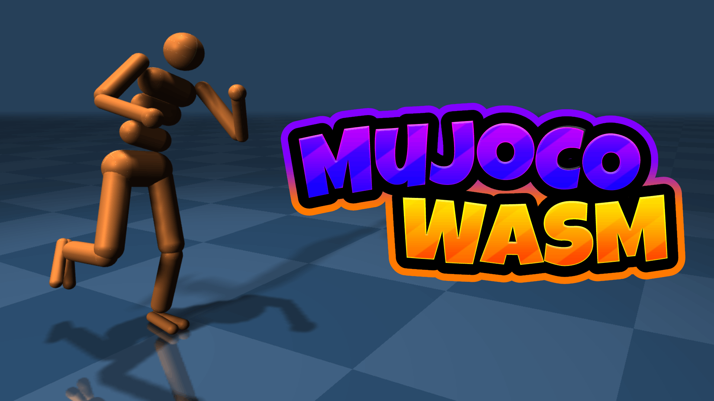

<p align="center">
  <a href="https://zalo.github.io/mujoco_wasm/"></a>
</p>
<p align="left">
  <a href="https://github.com/zalo/mujoco_wasm/deployments/activity_log?environment=github-pages">
      </a>
  <!--<a href="https://github.com/zalo/mujoco_wasm/deployments/activity_log?environment=Production">
      </a> -->
  <!--<a href="https://lgtm.com/projects/g/zalo/mujoco_wasm/context:javascript">
      </a> -->
  <a href="https://github.com/zalo/mujoco_wasm/commits/main">
      </a>
  <a href="https://github.com/zalo/mujoco_wasm/blob/main/LICENSE">
      </a>
</p>

## The Power of MuJoCo in your Browser.

Load and Run MuJoCo 3.12.0 Models using JavaScript and the official MuJoCo WebAssembly Bindings.

This project used to be a WASM compilation and set of javascript bindings for MuJoCo, but since Deepmind completed the official MuJoCo bindings, this project is now just a small demo suite in the `examples` folder.

### [See the Live Demo Here](https://zalo.github.io/mujoco_wasm/)

### [See a more Advanced Example Here](https://kzakka.com/robopianist/)

## Build

Simply ensure `npm` is installed and run `npm install` to pull three.js and MuJoCo's Official WASM bindings.

To serve and run the index.html page while developing, use an HTTP Server.  I like to use [five-server](https://github.com/yandeu/five-server).

## VR

On a WebXR-capable device (served over HTTPS), an `ENTER VR` button appears at the bottom of the page. Entering VR places you a couple of meters back from the scene at standing height while the simulation keeps running; exiting restores the desktop camera. The reflective floor renders true per-eye reflections in stereo.

With hand tracking (or controllers), pinch (or pull the trigger) near a dynamic body to grab it and drag it around, just like the mouse drag on desktop.

The **xArm7 Hand Teleop** scene is driven by your right hand: damped-least-squares differential IK (`src/utils/DiffIK.js`) drives the arm's stock position actuators so the gripper follows your hand's position and orientation, and your pinch diameter (or trigger) closes the gripper. Try picking up the cubes!

The **xArm7 Shadow Hand** scene mounts a Shadow Hand E3M5 on the arm (composed with MJCF `<attach>`), on a 1m column — in VR you stand at the column, so the robot arm works where your own arm does. The arm plus the hand's two wrist joints track your wrist in *delta mode*: your hand position when tracking is first acquired maps onto the robot's home pose, so the robot's workspace lands comfortably inside yours wherever you stand — recentering your headset (long-press the system button on Quest) resets the scene and recalibrates. Your five fingertips drive the eighteen finger actuators through fingertip-retargeting differential IK (`src/utils/HandRetarget.js`, the AnyTeleop/dex-retargeting formulation, with a DexPilot-style pinch refinement so robot fingertips meet when yours do).

The IK layer is written with real-hardware teleoperation in mind. Tracking follows a velocity law (a finite task gain rather than full-step correction, which limit-cycles against actuator lag), and the joint-position commands it emits (exposed via the `demo.onTeleopCommand(armJointTargets, gripperCtrl, handActuatorTargets)` hook) are safety-gated before they reach the actuators — the task-space target is clamped above the floor and into the reachable workspace, per-joint velocity is limited, commands are leashed to the measured joint positions (no windup when the arm is blocked), and every candidate command is evaluated kinematically on a shadow model: commands that would bring arm or hand geometry within 2 cm of the ground or increase self-collision are rejected, and when every path toward the target is blocked the arm retreats toward its neutral home posture (which also resolves the redundant elbow away from gimbal locks). Run `npm run test:ik` and `npm run test:hand` for the safety and retargeting regression suites.

## JavaScript API

```javascript
import load_mujoco from "@mujoco/mujoco";

// Load the MuJoCo Module
const mujoco = await load_mujoco();

// Set up Emscripten's Virtual File System
mujoco.FS.mkdir('/working');
mujoco.FS.mount(mujoco.MEMFS, { root: '.' }, '/working');
mujoco.FS.writeFile("/working/humanoid.xml", await (await fetch("./assets/scenes/humanoid.xml")).text());

// Load model and create data
let model = mujoco.MjModel.mj_loadXML("/working/humanoid.xml");
let data  = new mujoco.MjData(model);

// Access model properties directly
let timestep = model.opt.timestep;
let nbody = model.nbody;

// Access data buffers (typed arrays)
let qpos = data.qpos;  // Joint positions
let qvel = data.qvel;  // Joint velocities
let ctrl = data.ctrl;  // Control inputs
let xpos = data.xpos;  // Body positions

// Step the simulation
mujoco.mj_step(model, data);

// Run forward kinematics
mujoco.mj_forward(model, data);

// Reset simulation
mujoco.mj_resetData(model, data);

// Apply forces (force, torque, point, body, qfrc_target)
mujoco.mj_applyFT(model, data, [fx, fy, fz], [tx, ty, tz], [px, py, pz], bodyId, data.qfrc_applied);

// Clean up
data.delete();
model.delete();
```
